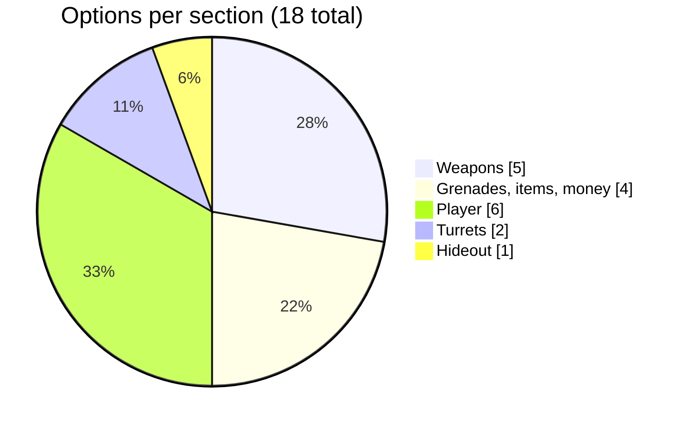
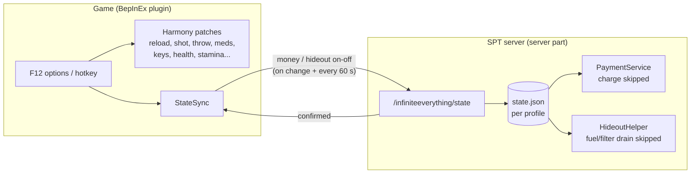

# Infinite Everything

Everything but always ever. A single-player [SPT](https://sp-tarkov.com) mod with 18 switchable "infinite" options: ammo, magazines, grenades, meds, keys, money, health, stamina, turrets, hideout fuel and more. Every option sits in the F12 menu and works alongside the others. One master hotkey turns the whole mod on or off, and it is **unbound by default**.

| | |
|---|---|
| **SPT** | 4.1.x (built against 4.1.6, EFT 0.16.9.40743) |
| **Parts** | client plugin (BepInEx) + small server part (needed only for money and hideout fuel) |
| **Affects** | the local player only, never bots |
| **License** | MIT |

## Install

1. Download `SPTMOD-Infinite-Everything-<version>.zip` from [Releases](../../releases).
2. Extract it into your SPT folder, the one that contains `EscapeFromTarkov.exe`. It adds:
   - `BepInEx\plugins\InfiniteEverything\InfiniteEverything.dll`
   - `SPT_Runtime\user\mods\InfiniteEverything\InfiniteEverythingServer.dll`
3. Start the server. It should log `[Infinite Everything] server part <version> loaded`.
4. Start the game, press **F12** and open **trappuss-InfiniteEverything**.

If you used the old **InfiniteAmmo** plugin, remove it first. The two are marked incompatible, so Infinite Everything won't load while it is installed.

## Options

**Infinite ammo** is on by default; every other option starts off. Turning any option (or the mod) off undoes it right away.

The full list is a spreadsheet: [`docs/options.csv`](docs/options.csv) (GitHub shows it as a sortable table).

| Section | Option | Server part |
|---|---|:-:|
| Weapons | Infinite ammo: reloads never use up magazines or rounds, including the double-tap quick reload. Shotguns, bolt-actions, revolvers and break-actions load to full, even with no rounds on you | |
| Weapons | Infinite magazine: rounds never leave the magazine, and an empty gun is refilled | |
| Weapons | Infinite weapon durability | |
| Weapons | Weapon reliability: no malfunctions or overheating | |
| Weapons | Launcher and flare ammo, including single-use launchers | |
| Grenades, items, money | Infinite grenades: same type, same slot, stays selected | |
| Grenades, items, money | Infinite item usage: meds, food, drinks, stims | |
| Grenades, items, money | Infinite key usage: keys, keycards, Labs card | |
| Grenades, items, money | Infinite money, incl. GP coins (non-destructive) | ✔ |
| Player | Infinite health (god mode) | |
| Player | Infinite energy and hydration | |
| Player | Infinite stamina: body, arms, breath | |
| Player | Infinite armor durability | |
| Player | Infinite carry weight | |
| Player | Infinite raid time | |
| Turrets | Turret ammo: the belt refills when empty | |
| Turrets | Turret magazine: rounds are never used | |
| Hideout | Infinite fuel and filters | ✔ |

### Infinite money is non-destructive

No money is ever added to or removed from your stash. While the option is on, the server part skips the charge and the client screens accept the purchase. Turn it off and you have exactly what you had before. In raid, money for paid exfils and BTR services is given back right after you pay, but you still need to carry it.

## How it works

Everything except money and hideout runs purely on the client. Money and hideout options only take effect after the server part confirms them. Without the server part those two options do nothing; nothing breaks.

## Build from source

You need the .NET 10 SDK and an SPT 4.1.x install. The game DLLs are referenced from your install and never copied into the repo.

- **`BUILD_AND_INSTALL.bat`** builds both parts, installs them into your SPT folder and packages `dist\SPTMOD-Infinite-Everything-<version>.zip`. It asks for the SPT folder once and saves it in `build.local.cfg`, which is not committed.
- **`COLLECT_LOG.bat`** gathers the mod's client and server log lines into `_build\ingame.log`, ready for a bug report.
- **`publish.bat`** pushes the repo and creates the GitHub release with the zip attached. Run it after the build.
- **`FORGE_PREP.bat`** checks that the release download link works, helps you get the VirusTotal scan, and opens The Forge with the listing text from [`docs/FORGE_LISTING.md`](docs/FORGE_LISTING.md).

The version lives in one place, `Directory.Build.props`. Also update `Plugin.PluginVersion` and the server `ModMetadata` to match.

## Notes

- This mod is for single-player SPT only. Play fair.
- See [CHANGELOG.md](CHANGELOG.md) for history.
